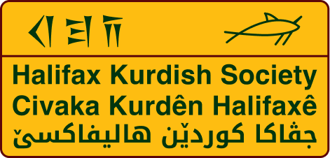

# Halifax Kurdish Society Website



A modern, bilingual web application for the Halifax Kurdish Society, dedicated to promoting Kurdish culture, language, and community in Halifax, Nova Scotia.

**English** | **Kurdî**

---

## 🎯 Purpose

The Halifax Kurdish Society website serves as a digital hub for:
- **Community engagement** through cultural events and educational programs
- **Cultural preservation** by promoting Kurdish language and heritage
- **Accessibility** with full bilingual support (English & Kurdish)
- **Information sharing** about the society's mission, events, and committee

---

## 🛠️ Tech Stack

- **Frontend Framework:** [React 18](https://react.dev) - Component-based UI architecture
- **Routing:** [React Router v6](https://reactrouter.com) - Client-side navigation with dynamic routes
- **Internationalization:** [i18next](https://www.i18next.com) - Full bilingual support (English & Kurdish)
- **Styling:** [Tailwind CSS](https://tailwindcss.com) - Utility-first CSS framework for responsive design
- **Build Tool:** [Vite](https://vitejs.dev) - Next-generation frontend tooling for fast development
- **Package Manager:** npm

---

## ✨ Features

- ✅ **Bilingual Support** - Seamless language switching between English and Kurdish
- ✅ **Responsive Design** - Mobile-first approach with Tailwind CSS
- ✅ **Multi-Page Navigation** - Organized pages for Home, About, Events, Committee, and Goals
- ✅ **Dynamic Event Display** - Scalable event management system
- ✅ **Modern UX** - Smooth transitions, hover effects, and intuitive navigation

---

## 🚀 Getting Started

### Prerequisites
- Node.js (v14 or higher)
- npm or yarn

### Installation

1. **Clone the repository:**
   ```bash
   git clone https://github.com/ali-alhusseini/halifax-kurdish.git
   cd halifax-kurdish
   ```

2. **Install dependencies:**
   ```bash
   npm install
   ```

3. **Start development server:**
   ```bash
   npm run dev
   ```
   Open [http://localhost:5173](http://localhost:5173) in your browser.

### Build for Production
```bash
npm run build
```

---

## 📁 Project Structure

```
src/
├── components/        # Reusable React components
│   ├── Navbar.jsx
│   ├── Footer.jsx
│   └── NavigationCards.jsx
├── pages/            # Page components for routing
│   ├── Home.jsx
│   ├── About.jsx
│   ├── Events.jsx
│   ├── Committee.jsx
│   └── Goals.jsx
├── locales/          # i18n translation files
│   ├── en.json      # English translations
│   └── ku.json      # Kurdish translations
├── assets/           # Images and static files
├── App.jsx          # Main app router configuration
├── main.jsx         # Application entry point
└── index.css        # Global styles
```

---

## 🌍 Internationalization (i18n)

The site supports multiple languages through i18next:
- **English (en)**
- **Kurdish (ku)**

Translation files are stored in `src/locales/` as JSON objects. Add new content by updating both language files.

---

## 💡 Key Implementation Details

### Dynamic Routing with React Router
- Routes defined in `App.jsx` for seamless navigation
- Each page component uses `useTranslation()` hook for localized content

### State Management & i18n
- Uses React Context and hooks (via i18next)
- Language switching handled in Navbar component
- All content automatically updates on language change

### Responsive Design
- Tailwind's grid and flexbox utilities for responsive layouts
- Mobile-first approach with `md:` and `lg:` breakpoints

---

## 📝 Content Management

All text content is centralized in `/src/locales/`:
- **en.json** - English translations
- **ku.json** - Kurdish translations

To add new pages or features, simply:
1. Add translation keys to both locale files
2. Create new component with `useTranslation()` hook
3. Add route to `App.jsx`

---

## 🤝 Contributing

Contributions are welcome! Feel free to:
- Report issues
- Submit pull requests
- Suggest improvements

---

## 📄 License

This project is open source and available under the MIT License.

---

**Welcome to the Halifax Kurdish Society! | Hûn bi xêr hatine Civaka Kurdên Halifaxê!**
